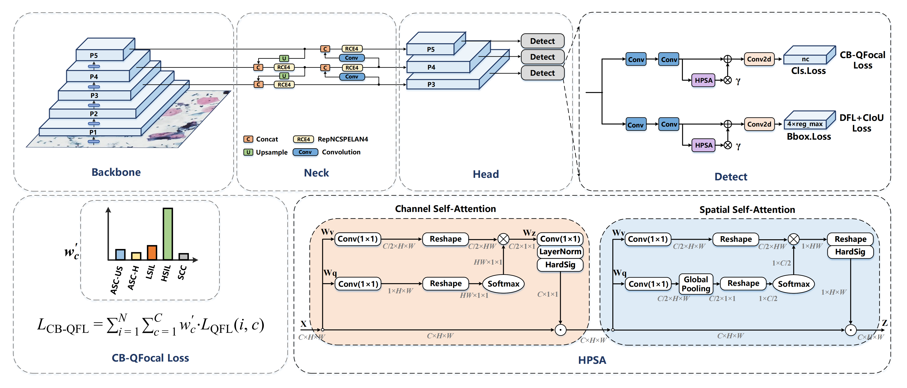

# YOLO-TCT: An Effective Network for Long-Tailed Cervical Cell Detection

The proposed YOLO-TCT network builds upon the YOLOv9 architecture, featuring key modifications in the detection head and loss functions.

## Notifications

- We modified the original code from [ultralytics](https://github.com/ultralytics/ultralytics) to adapt to our model. 
- Our proposed YOLO-TCT model is available at [yolov9c-LRRDetectHead.yaml](ultralytics\ultralytics\cfg\models\v9\yolov9c-LRRDetectHead.yaml)
- Our proposed CB-QFOCAL loss is available at [cb_qfocal.py](ultralytics\ultralytics\utils\custom_loss\cb_qfocal.py)
- To use different cls loss function, please modify [utils/loss.py](ultralytics\ultralytics\utils\loss.py) following our instructions in the code.